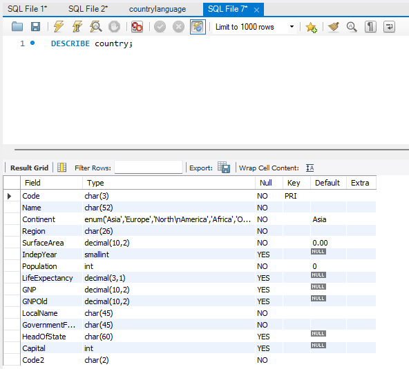
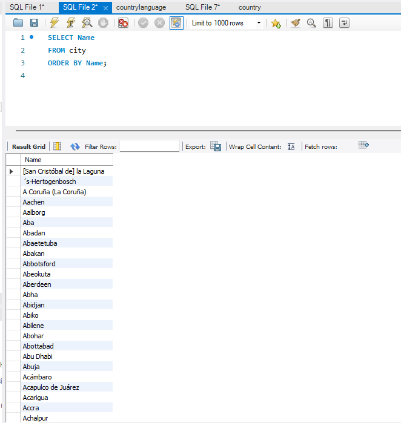
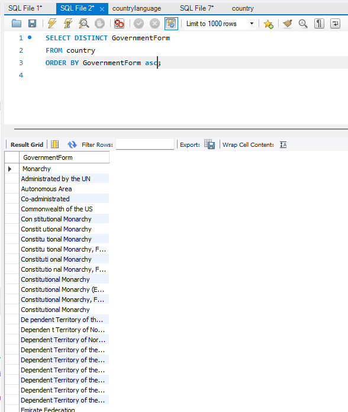
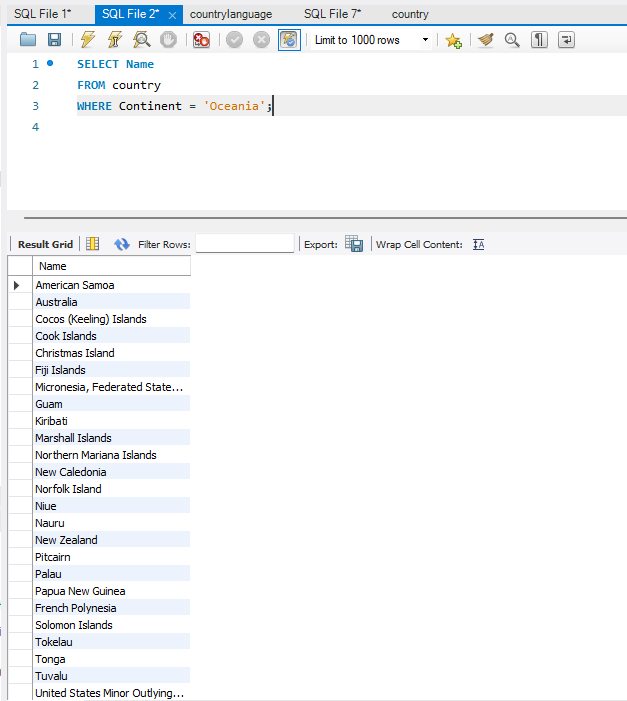
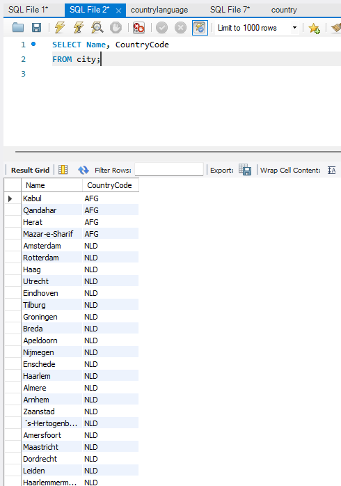

# Exercise 01: World Database SQL Practice

- Name: Kim Hummel
- Course: Database for Analytics
- Module: 1
- Database Used: World Database

---

See:

[MySQL: Setting Up the World Database](https://dev.mysql.com/doc/world-setup/en/)

---

## Instructions

- Answer each question below.
- All SQL commands **must be executed** against the World database.
- For each SQL command:
  - Include the SQL in a fenced code block
  - Include a **screenshot** showing the command and results
- Store screenshots in the `screenshots/` folder and embed them below each answer.

---

## Question 1

**Compare and contrast the data types used for:**

- `country.Population`
- `country.LifeExpectancy`

Why were these data types selected?

### Answer

They were selected because they are both numerical data sets so you want the data type to be numerical.
Population is an integer because you cannot have a decimal of a person, you can only have a full person so your answer must be an integer.
Life Expectancy is a decimal because time is not capture in full years only. You can live part of a year which is why its data type is a decimal.

### Screenshot

_Show the table structure or DESCRIBE output._

```sql
DESCRIBE country;
```



---

## Question 2

**What is the data type of `country.IndepYear`?**
Why do you think this data type was selected?

### Answer

The data type of Indep.Year is smallint, which contains integers between -32,768 and 32,767. This was selected most likely because a smallint requires less storage space, and we know that the values will not be above the current year, so they will not be above 2026.

### Screenshot

```sql
DESCRIBE country;
```


---

## Question 3

**Make a case for a different data type for `country.IndepYear`.**
Explain why your proposed data type might be better in some situations.

### Answer

You could use the YEAR data type for IndepYear.

---

## Question 4

Write a SQL command to **list the names of all cities in alphabetical order**.

### SQL

```sql
SELECT Name
FROM city
ORDER BY Name;
```

### Screenshot



---

## Question 5

Write a SQL command to
**list all forms of government from the `country` table**,
showing **each only once**, sorted alphabetically.

### SQL

```sql
SELECT DISTINCT GovernmentForm
FROM country
ORDER BY GovernmentForm;
```

### Screenshot



---

## Question 6

Write a SQL command to **list all countries in the `Oceania` continent**.

### SQL

```sql
SELECT Name
FROM country
WHERE Continent = 'Oceania';
```

### Screenshot



---

## Question 7

Write a SQL command to **list the names and country code of all cities**.

### SQL

```sql
SELECT Name, CountryCode
FROM city;
```

### Screenshot



---

## Question 8

Write a SQL command to **update the city named `"Nashville-Davidson"` to `"Nashville"`**.

### SQL

```sql
UPDATE city
SET Name = 'Nashville'
WHERE Name = 'Nashville-Davidson';
```

### Screenshot


---

## Question 9

Write a SQL command to **insert a new country named `"Narnia"`**
with a country code of `"NAR"`.
Use reasonable values for the remaining columns.

### SQL

```sql
INSERT INTO country (Code, Name, Continent, Region, Population)
VALUES ('NAR', 'Narnia', 'Europe', 'Fantasy', 1000000);
```

### Screenshot


---

## Question 10

Write a SQL command to **delete the country with the country code `"NAR"`**.

### SQL

```sql
DELETE FROM country
WHERE Code = 'NAR';
```

### Screenshot


