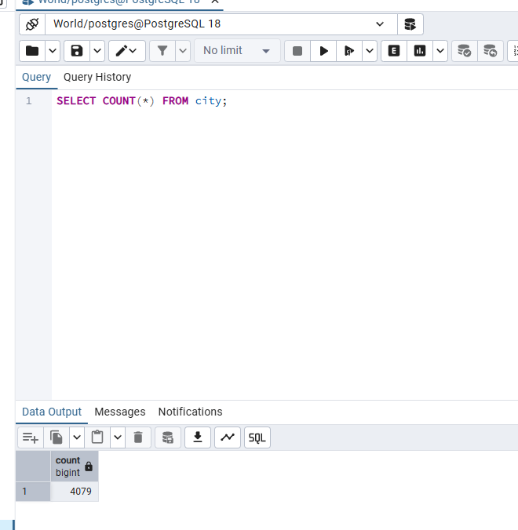
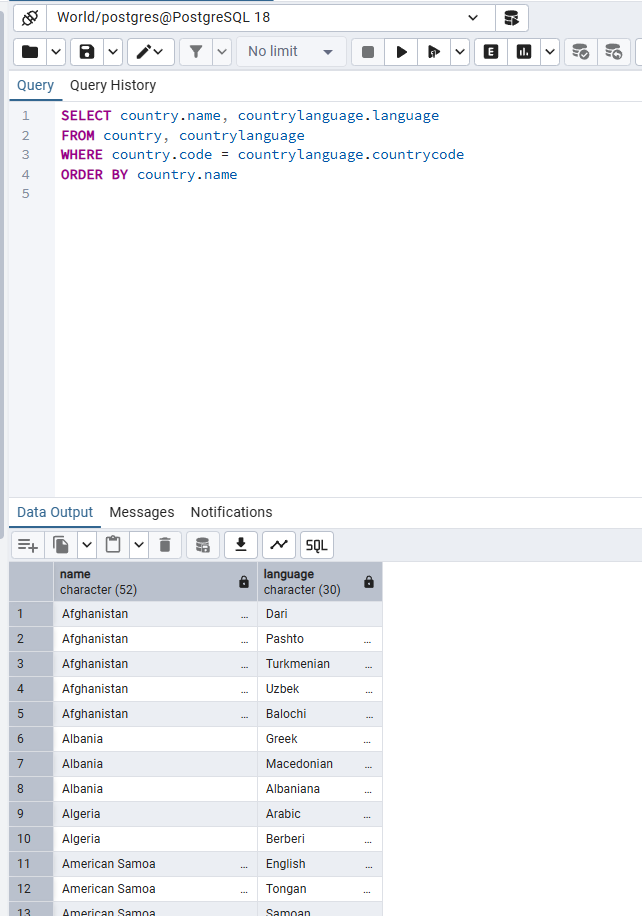
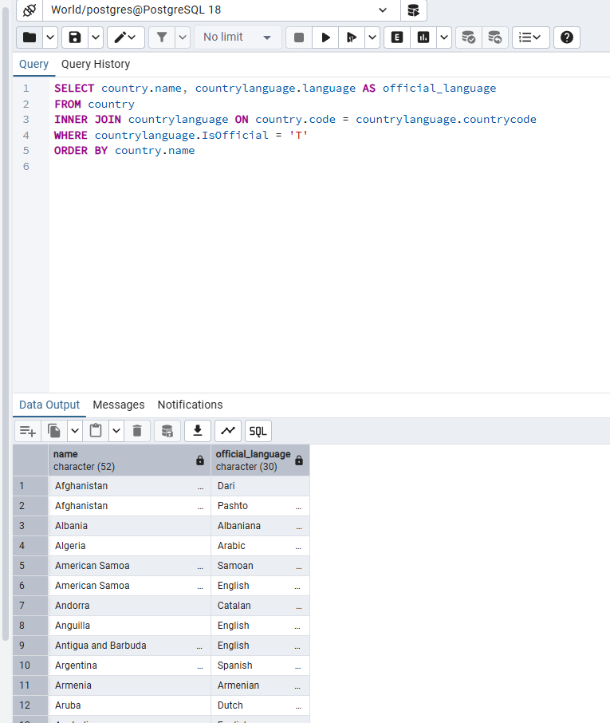
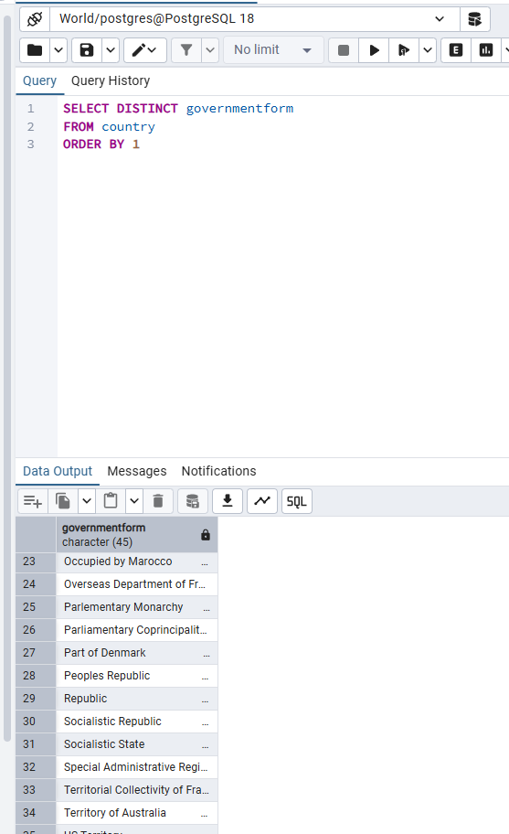
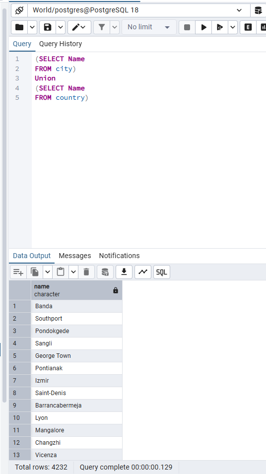
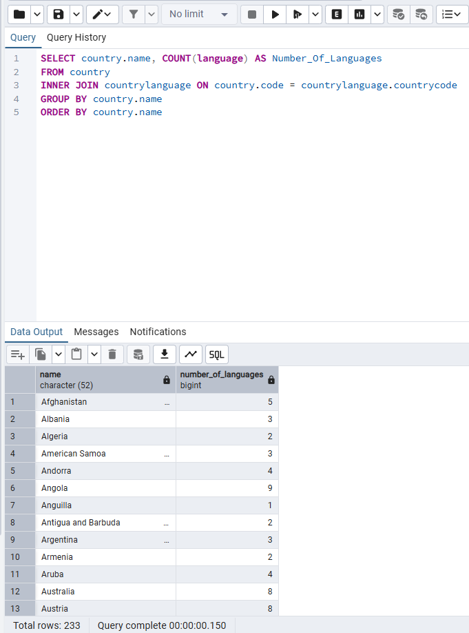
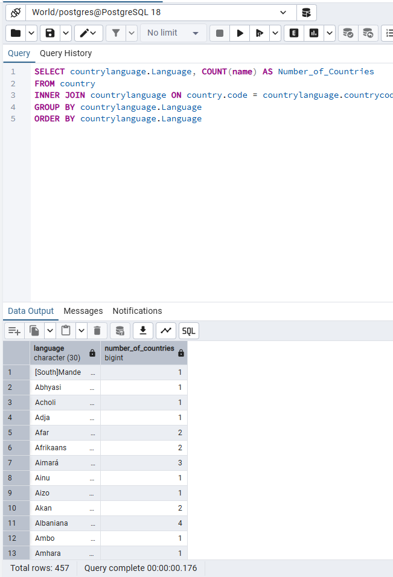
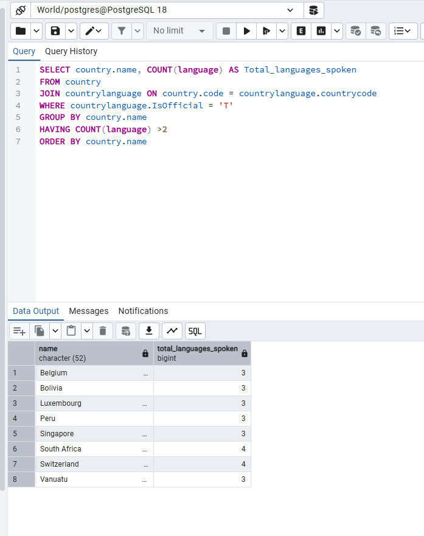
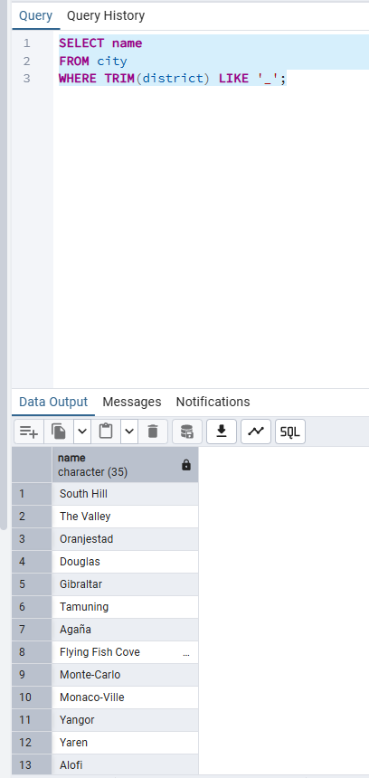
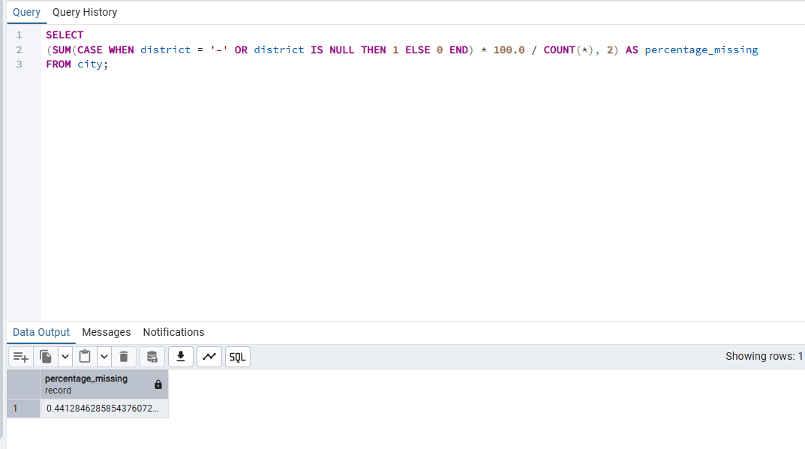

# Exercise 02: World Database – Joins, Grouping, and Data Quality

- Name: Kim Hummel
- Course: Database for Analytics
- Module: 2
- Database Used: World Database (PostgreSQL)

---

## Instructions

- Answer each question below using SQL executed against the **World database**.
- All SQL commands **must be run by you**.
- For each SQL-based question:
  - Include the SQL command in a fenced code block
  - Include a **screenshot** showing the command and its results
- Store screenshots in the `screenshots/` folder and embed them below each answer.

---

## Question 1

When importing records from `worldPGSQL.sql`, **how many cities were imported**?

### Answer

There are 4,079 cities.

### Screenshot

_Show evidence of how you determined this (for example, a COUNT query)._

```sql
SELECT COUNT(*) FROM city;
```



---

## Question 2

Using the World database, write the SQL command to
**display each country name**
along with the **name of each language spoken in that country**.

### SQL

```sql
SELECT country.name, countrylanguage.language
FROM country, countrylanguage
WHERE country.code = countrylanguage.countrycode
ORDER BY country.name
```

### Screenshot



---

## Question 3

Using the World database, write the SQL command
to **display each country name** along with the name
of each **official language spoken in that country**.

### SQL

```sql
SELECT country.name, countrylanguage.language AS official_language
FROM country
INNER JOIN countrylanguage ON country.code = countrylanguage.countrycode
WHERE countrylanguage.IsOfficial = 'T'
ORDER BY country.name
```

### Screenshot



---

## Question 4

Consider the following two SQL statements:

```sql
SELECT *
FROM country, countrylanguage
WHERE country.code = countrylanguage.countrycode;
```

```sql
SELECT *
FROM country
LEFT OUTER JOIN countrylanguage
ON country.code = countrylanguage.countrycode;
```

**In your own words**, describe what data the
**second query returns that the first query does not**.

### Answer

The second query returns data that is in the country table that does not have any corresponding data in the countrylanguage table. When you run the queries you find that the left out join query contains 990 rows while not using a join command only produces 984 rows. When you look at the last six rows in the second query with the join, you find six rows that have "null" for column originating from the countrylanguage table.

---

## Question 5

Using the World database, write the SQL command
to **list all different forms of government** found in the data.
Do **not** repeat any form of government more than once.

### SQL

```sql
SELECT DISTINCT governmentform
FROM country
ORDER BY 1
```

### Screenshot



---

## Question 6

Using the World database, write the SQL command
to **list all names of cities and countries in one column**.
Label the column **"City or Country Name"**.

### SQL

```sql
(SELECT Name
FROM city)
Union
(SELECT Name
FROM country)
```

### Screenshot



---

## Question 7

Using the World database, write the SQL command
to **list all countries by name**,
along with the **number of languages spoken in each country**.
Be sure to **sort by country name**.

### SQL

```sql
SELECT country.name, COUNT(language) AS Number_Of_Languages
FROM country
INNER JOIN countrylanguage ON country.code = countrylanguage.countrycode
GROUP BY country.name
ORDER BY country.name
```

### Screenshot



---

## Question 8

Using the World database, write the SQL command
to **list all languages**, along with the
**number of countries where each language is spoken**.
Be sure to **sort by language name**.

### SQL

```sql
SELECT countrylanguage.Language, COUNT(name) AS Number_of_Countries
FROM country
INNER JOIN countrylanguage ON country.code = countrylanguage.countrycode
GROUP BY countrylanguage.Language
ORDER BY countrylanguage.Language
```

### Screenshot



---

## Question 9

Using the World database, write the SQL command
to **list countries that have more than two official languages**,
along with the **number of official languages spoken**.

_Hint: There are 8 such countries in this dataset._

### SQL

```sql
SELECT country.name, COUNT(language) AS Total_languages_spoken
FROM country
JOIN countrylanguage ON country.code = countrylanguage.countrycode
WHERE countrylanguage.IsOfficial = 'T'
GROUP BY country.name
HAVING COUNT(language) >2
ORDER BY country.name
```

### Screenshot



---

## Question 10

Using the World database, write the SQL command to
**find cities where the district value is missing**.

Hint: Use `LIKE` and the dash (`-`)
since some rows use that instead of actual data.

### SQL

```sql
SELECT name
FROM city
WHERE TRIM(district) LIKE '_';
```

### Screenshot



---

## Question 11

Using the World database, write the SQL command to
**calculate the percentage of cities with missing district values**.

_Hint: The result should be approximately 0.4%._

### SQL

```sql
SELECT
(SUM(CASE WHEN district = '–' OR district IS NULL THEN 1 ELSE 0 END) * 100.0 / COUNT(*), 2) AS percentage_missing
FROM city;
```

### Screenshot


