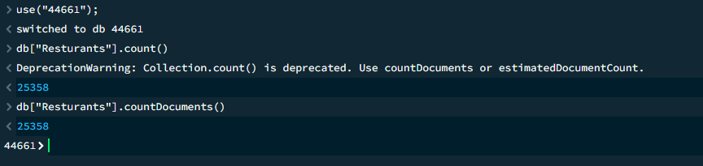
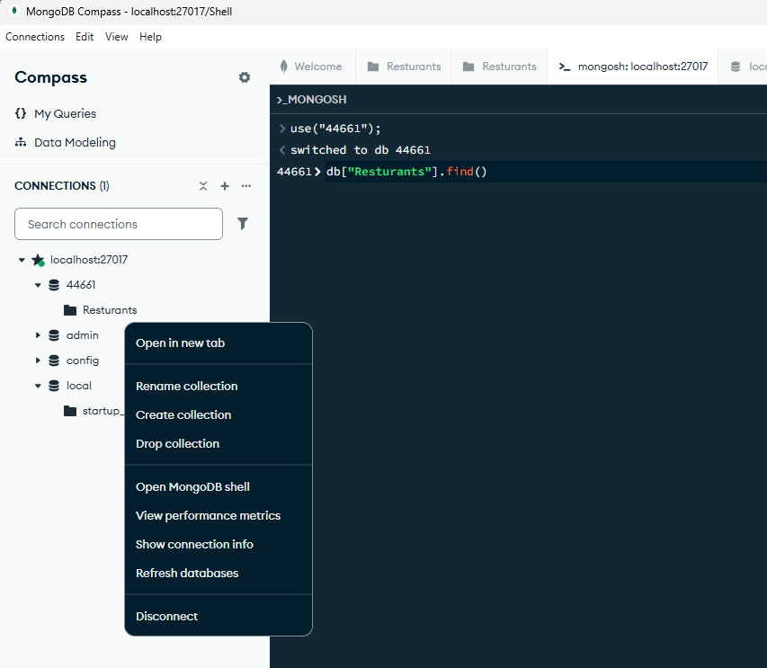
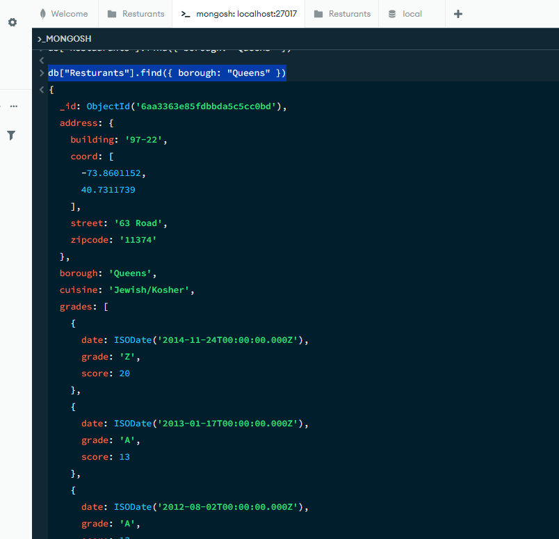
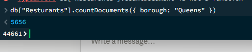
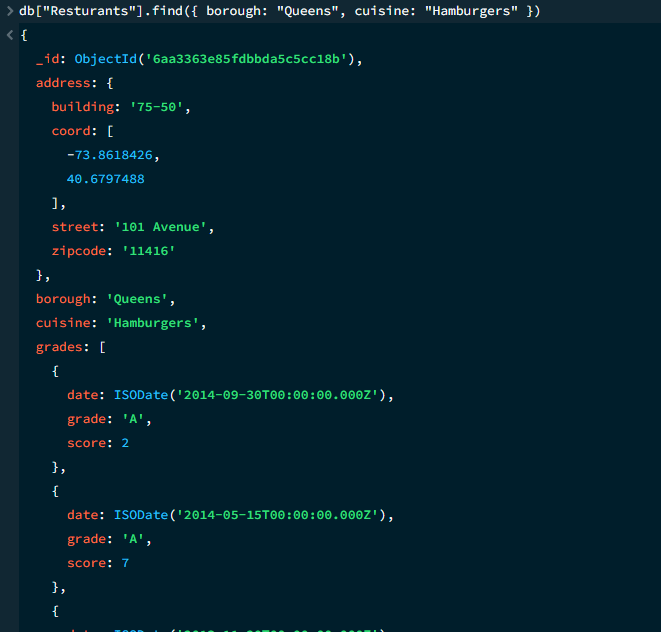
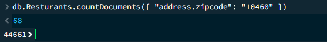
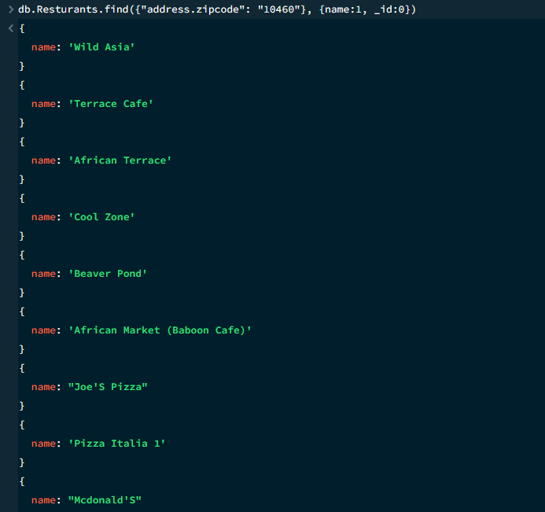
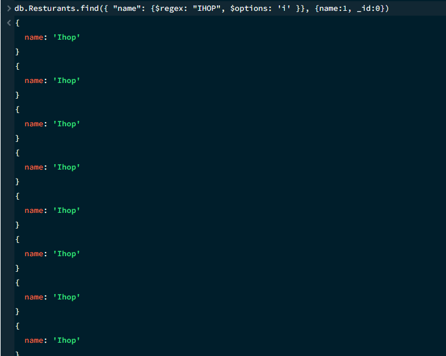

# Exercise 03: MongoDB – Document Queries and Analysis

- Name:
- Course: Database for Analytics
- Module: 3
- Database Used: MongoDB
- Dataset: `restaurants-json.json`

---

## Instructions

- Import the provided `restaurants-json.json` file into MongoDB.
- All commands must be **executed by you** in the MongoDB shell or MongoDB Compass.
- For each query:
  - Include the MongoDB command in a fenced code block
  - Include a **screenshot** showing the command and its result
- Store screenshots in the `screenshots/` folder and embed them below each answer.

---

## Question 1

When importing the documents from `restaurants-json.json`,
**how many documents were imported into your collection**?

### Answer

There are 25,358 documents

### Screenshot

_Show evidence of how you determined this (for example, a count query)._

```javascript
db["Resturants"].countDocuments()
```



---

## Question 2

Before writing queries on the data,
**what command** do you use to set the
**MongoDB shell to operate on the `44661` database**?

### MongoDB Command

```javascript
use("44661");
```

### Screenshot
This is the command used. However, when I right click on the 'Resturants' folder I am able to click the option 'Open MongoDB shell and it already completed the command for me.



---

## Question 3

Using your `restaurants` collection in the `44661` database,
write the MongoDB query needed to
**locate all documents in the `"Queens"` borough**.

### MongoDB Query

```javascript
db["Resturants"].find({ borough: "Queens" })
```

### Screenshot



---

## Question 4

Using your `restaurants` collection in the `44661` database,
write the MongoDB query needed to
**find the number of restaurants in the `"Queens"` borough**.

### MongoDB Query

```javascript
db["Resturants"].countDocuments({ borough: "Queens" })
```

Counting the number of documents that meet a request. 

### Screenshot



---

## Question 5

Using your `restaurants` collection in the `44661` database,
write the MongoDB query needed to
**find the number of restaurants** in the `"Queens"` borough
**whose cuisine is `"Hamburgers"`**.

### MongoDB Query

```javascript
db["Resturants"].find({ borough: "Queens", cuisine: "Hamburgers" })
```

This is a find for multiple constraints/requests.

### Screenshot



---

## Question 6

Using your `restaurants` collection in the `44661` database,
write the MongoDB query needed to
**find the number of restaurants in Zipcode `10460`**.

_Hint: Look up how to query **embedded documents**._

### MongoDB Query

```javascript
db.Resturants.countDocuments({ "address.zipcode": "10460" })
```

This is for embedded documents. Address is imbedded in restaurants and we want zipcode which lies in the address document.

### Screenshot



---

## Question 7

Using your `restaurants` collection in the `44661` database,
write the MongoDB query needed to
**display only the names of restaurants in Zipcode `10460`**.

_Hint: [Look up how to **project fields** in MongoDB.](https://www.youtube.com/watch?v=SbLZdi9X_x8)_

### MongoDB Query

```javascript
db.Resturants.find({"address.zipcode": "10460"}, {name:1, _id:0})
```

name:1, _id:0 means to show just the name. The id will always show up unless you tell it not to. 1 = true and 0 = false
Must be in its own curly brackets after the set of curly brackets that tell you want you are finding.

### Screenshot



---

## Question 8

Using your `restaurants` collection in the `44661` database,
write the MongoDB query needed to
**display only the names of restaurants whose name contains `"IHOP"`**,
ignoring case.


### MongoDB Query

```javascript
db.Resturants.find({ "name": {$regex: "IHOP", $options: 'i' }}, {name:1, _id:0})
```

$regrex: "IHOP" means find all names (since that is on the other side of the colon) that contain IHOP.

$options: 'i' = insensitive case matching

Getting started using regrex https://www.youtube.com/watch?v=Uyf4WEK6pHs

Directions for case sensitivity https://www.youtube.com/watch?v=fEgGGHG888w

### Screenshot


