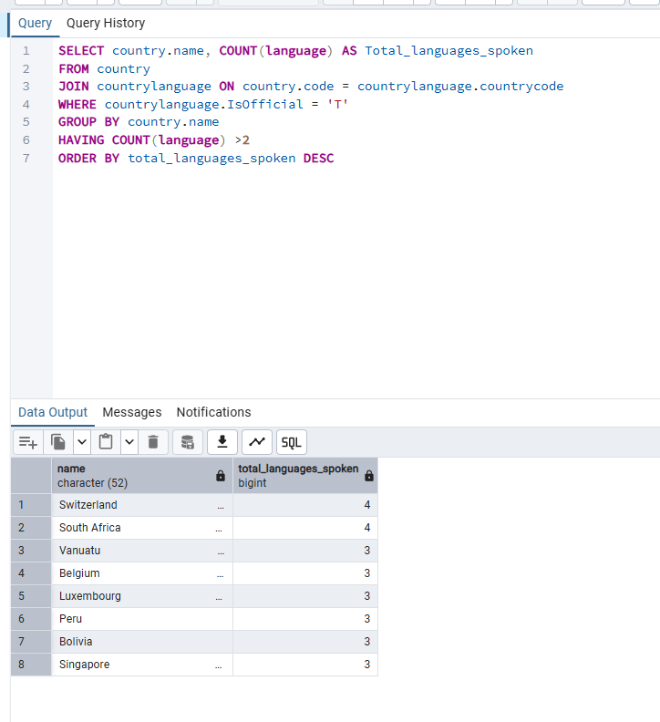
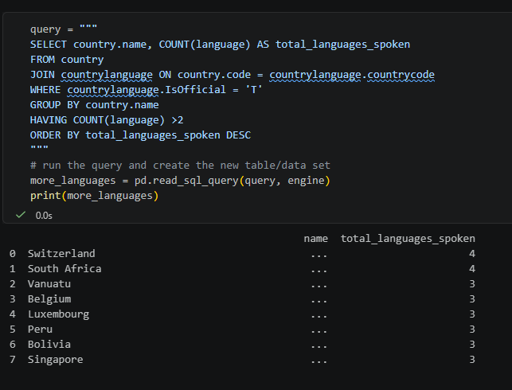
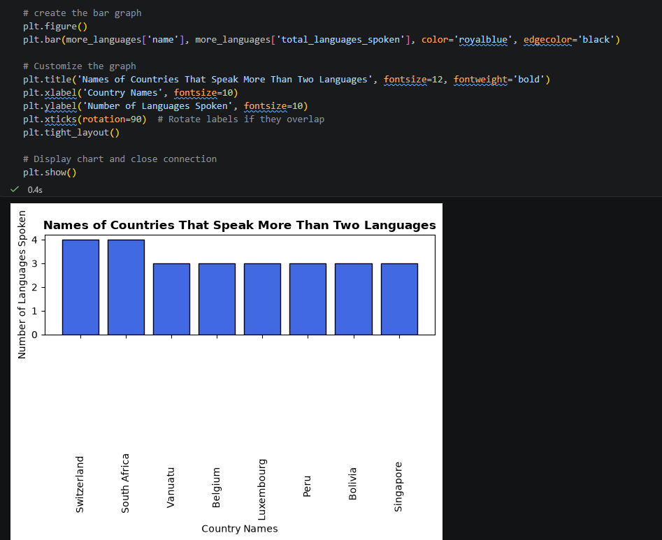

# Exercise 04: Advanced SQL, Jupyter, and Visualization

- Name: Kim Hummel
- Course: Database for Analytics
- Module: 4
- Database Used: World Database
- Tools Used: PostgreSQL, SQLAlchemy, Pandas, Jupyter Notebooks

---

## Instructions

- Complete each task using the **World database** installed earlier.
- For SQL questions:
  - Write the SQL command in a fenced code block
  - Execute the command and include a **screenshot of the results**
- For Jupyter Notebook questions:
  - Include the required Python statements
  - Include **screenshots of the notebook output**
- Store all screenshots in the `screenshots/` folder and embed them below each question.

---

## Question 1

Considering the World database, write a SQL statement that will
**display the names of countries**
that speak **more than two official languages**,
along with the **number of official languages spoken**.

- Sort the results by **number of languages**, from **most to least**.
- _Hint: There are fewer than 10 countries in the results._

### SQL

```sql
SELECT country.name, COUNT(language) AS Total_languages_spoken
FROM country
JOIN countrylanguage ON country.code = countrylanguage.countrycode
WHERE countrylanguage.IsOfficial = 'T'
GROUP BY country.name
HAVING COUNT(language) >2
ORDER BY total_languages_spoken DESC
```

### Screenshot



---

## Question 2

Using **Jupyter Notebooks**, you must use the
`create_engine` command to connect to your database.

After the `create_engine` command is executed,
**what are the three statements** required to
execute the query from Question 1 and
**display the results in the notebook**?

### Python Code

AFter I ran the 'create_engine' command, I only had two sets of code that I needed to run. The first was:
```python
query = """
SELECT country.name, COUNT(language) AS total_languages_spoken
FROM country
JOIN countrylanguage ON country.code = countrylanguage.countrycode
WHERE countrylanguage.IsOfficial = 'T'
GROUP BY country.name
HAVING COUNT(language) >2
ORDER BY total_languages_spoken DESC
"""
```

And the second was:

```python
# run the query and create the new table/data set
more_languages = pd.read_sql_query(query, engine)
print(more_languages)
```


### Screenshot



---

## Question 3

Using **Jupyter Notebooks**, write the Python code needed
to produce the following graph:


(The graph shows country-level results derived from the World database.)

### Python Code

```python
# create the bar graph
plt.figure()
plt.bar(more_languages['name'], more_languages['total_languages_spoken'], color='royalblue', edgecolor='black')

# Customize the graph
plt.title('Names of Countries That Speak More Than Two Languages', fontsize=12, fontweight='bold')
plt.xlabel('Country Names', fontsize=10)
plt.ylabel('Number of Languages Spoken', fontsize=10)
plt.xticks(rotation=90)  # Rotate labels if they overlap
plt.tight_layout()

# Display chart and close connection
plt.show()
```

### Screenshot


