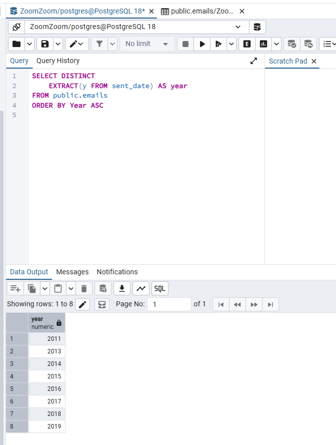
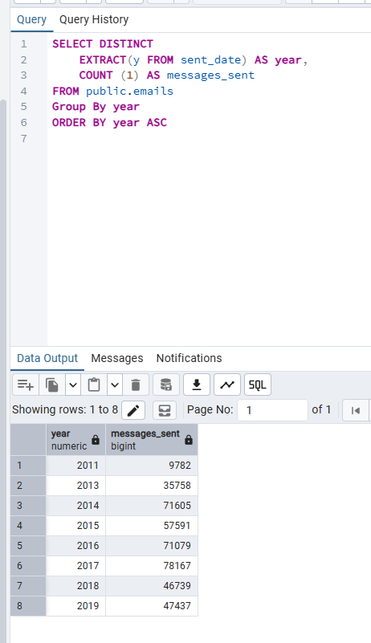
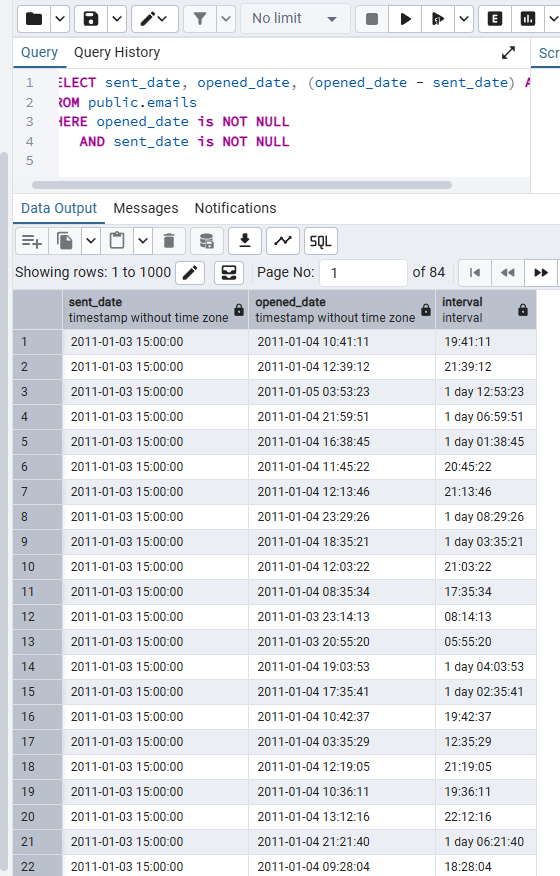
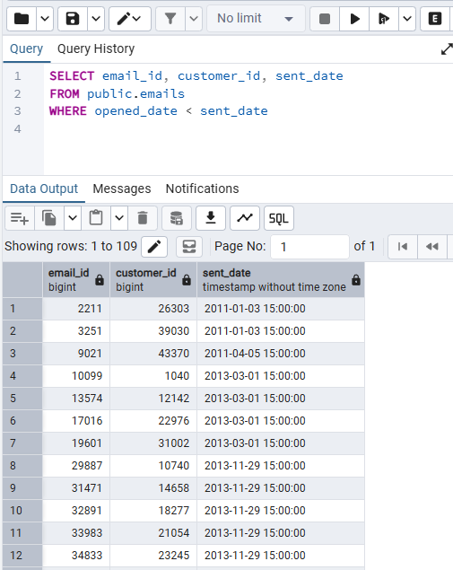
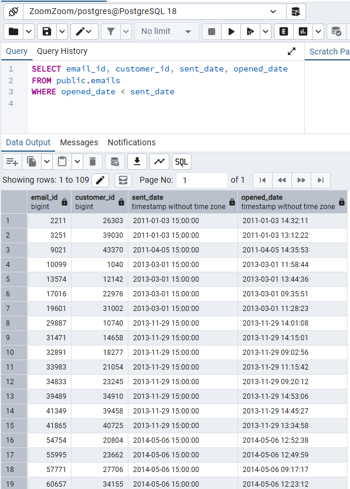
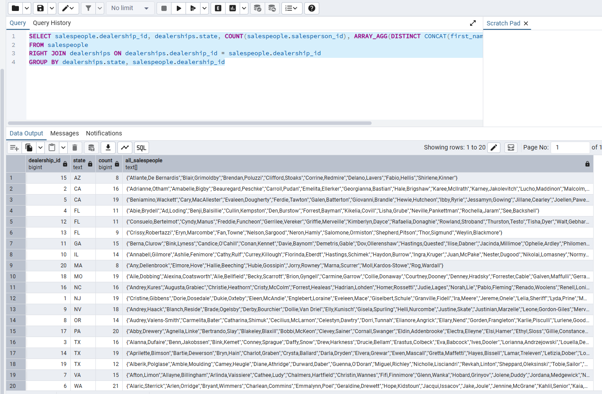
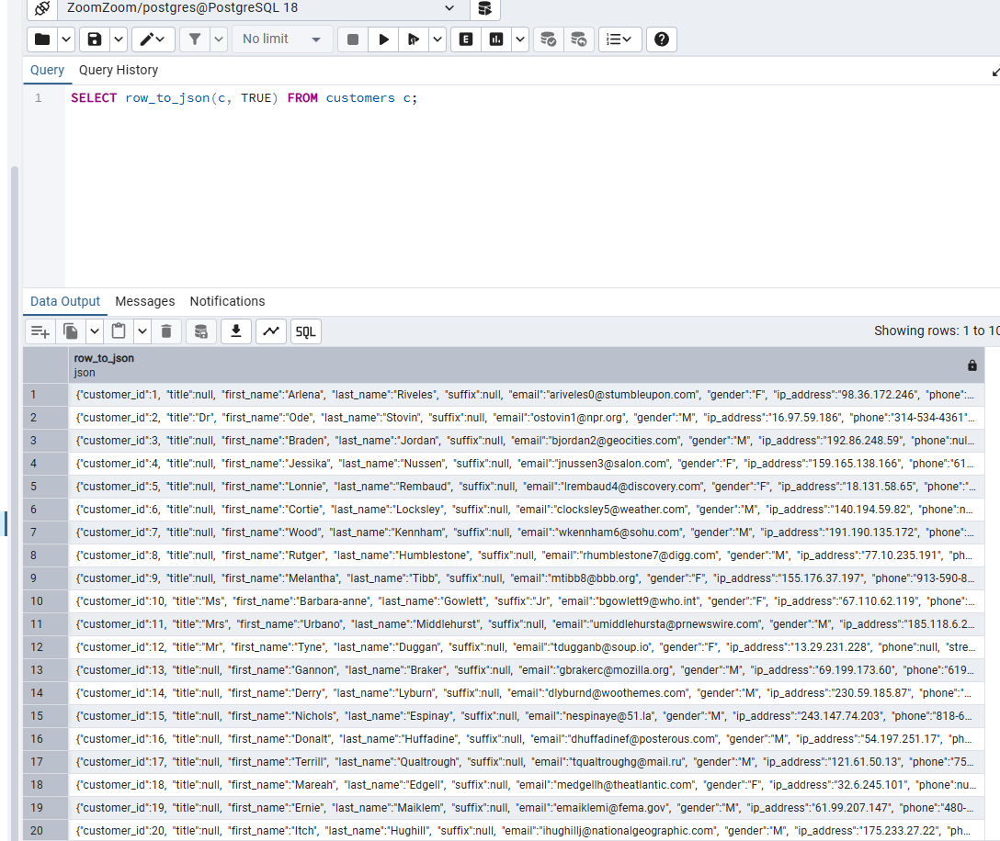
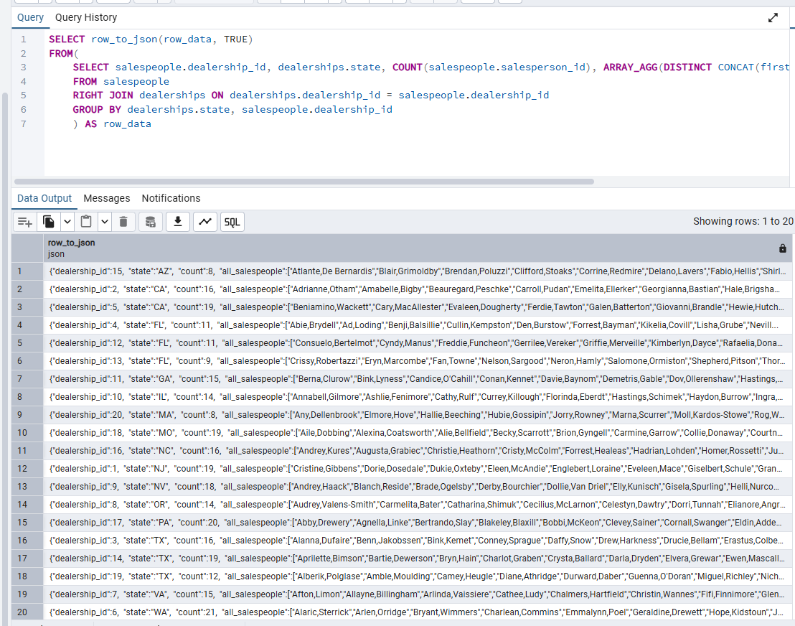

# Exercise 05: SQLDA Database - Dates, Data Quality, Arrays, and JSON

- Name: Kim Hummel
- Course: Database for Analytics
- Module: 5
- Database Used: `sqlda` (Sample Datasets)
- Tools Used: PostgreSQL (pgAdmin or psql)

---

## Instructions

- Use the **sqlda** database from the "Loading the Sample Datasets" instructions.
- For each SQL task:
  - Include your SQL in a fenced code block
  - Execute it and include a **screenshot** showing the query and results
- Store screenshots in the `screenshots/` folder and embed them below each answer.
- For explanation questions:
  - Write your answer in complete sentences
  - Include a screenshot if requested

---

## Question 1

Using the `sqlda` database, write the SQL needed
to show a **list of years** that emails were sent.

Your results should list years like this (order matters):

```text
year
2011
2013
2014
2015
2016
2017
2018
2019
```

### SQL

```sql
SELECT DISTINCT
	EXTRACT(y FROM sent_date) AS year
FROM public.emails
ORDER BY Year ASC
```

### Screenshot



---

## Question 2

Using the `sqlda` database, write the SQL needed to
show the **number of messages sent by year**,
ordered by year (as shown in the prompt).


### SQL

```sql
SELECT DISTINCT
	EXTRACT(y FROM sent_date) AS year,
	COUNT (1) AS messages_sent
FROM public.emails
Group By year
ORDER BY year ASC
```

### Screenshot



---

## Question 3

Using the `sqlda` database, write the SQL needed to show:

- the **sent date**
- the **opened date**
- the **interval** between the two

Only include emails that contain **both** a sent date and an opened date.

### SQL

```sql
SELECT sent_date, opened_date, (opened_date - sent_date) AS interval
FROM public.emails
WHERE opened_date is NOT NULL
	AND sent_date is NOT NULL
```

### Screenshot



---

## Question 4

Using the `sqlda` database,
write the SQL needed to
show emails that contain an **opened date BEFORE the sent date**.

### SQL

```sql
SELECT email_id, customer_id, sent_date
FROM public.emails
WHERE opened_date < sent_date
```

### Screenshot



---

## Question 5

Using the `sqlda` database:
there are **over 100 emails**
that contain an opened date **BEFORE** the sent date.

After looking at the data, **why is this the case?**

### Answer

The sent_date column looks as though that data was truncated, meaning it used the greatest rounded value for each specific date (15:00 hours in most cases), as opposed to the actual time it was sent. This means that some values are rounded up, to a later time than they were actually sent which is what is causing our data to say that emails were opened before they were sent.

### Screenshot (if requested by instructor)



---

## Question 6
Using the `sqlda` database, explain in your own words what the following code does:

```sql
CREATE TEMP TABLE customer_points AS (
    SELECT
        customer_id,
        point(longitude, latitude) AS lng_lat_point
    FROM customers
    WHERE longitude IS NOT NULL
    AND latitude IS NOT NULL
);

CREATE TEMP TABLE dealership_points AS (
    SELECT
        dealership_id,
        point(longitude, latitude) AS lng_lat_point
    FROM dealerships
);

CREATE TEMP TABLE customer_dealership_distance AS (
    SELECT
       customer_id,
       dealership_id,
       c.lng_lat_point <@> d.lng_lat_point AS distance
    FROM customer_points c
    CROSS JOIN dealership_points d
);
```

### Answer

The first two temporary tables create location coordinates for the customers and dealerships respectively. We use the last table to find the distance from the customer to every dealership. This means that there are multiple rows with the same customer ID because we are showing the relationships between each individual customer and all 20 of the dealerships.

---

## Question 7

Using the `sqlda` database,
write SQL to display an
**array of salespeople for each dealership**,
sorted by dealership.


### SQL

```sql
SELECT dealership_id, ARRAY_AGG(DISTINCT CONCAT(first_name, ',', last_name)) AS full_names
FROM salespeople
GROUP BY dealership_id;
```

### Screenshot


---

## Question 8

Using the `sqlda` database, write SQL to display:

- an **array of salespeople for each dealership**
- the **state** of the dealership
- the **number of salespeople** for the dealership
Sort by **state**.

Reference image:


### SQL

```sql
SELECT salespeople.dealership_id, dealerships.state, COUNT(salespeople.salesperson_id), ARRAY_AGG(DISTINCT CONCAT(first_name, ',', last_name)) AS all_salespeople
FROM salespeople
RIGHT JOIN dealerships ON dealerships.dealership_id = salespeople.dealership_id
GROUP BY dealerships.state, salespeople.dealership_id

```

### Screenshot



---

## Question 9

Using the `sqlda` database, write the SQL needed to convert
the **customers** table to **JSON**.

### SQL

```sql
SELECT row_to_json(c, TRUE) FROM customers c;
```

### Screenshot



---

## Question 10

Using the `sqlda` database, write SQL to display:

- an **array of salespeople for each dealership**
- the **state**
- the **number of salespeople**
- sorted by **state**

Then **convert this result to JSON**.

Reference image:


### SQL

```sql
SELECT row_to_json(row_data, TRUE)
FROM(
	SELECT salespeople.dealership_id, dealerships.state, COUNT(salespeople.salesperson_id), ARRAY_AGG(DISTINCT CONCAT(first_name, ',', last_name)) AS all_salespeople
	FROM salespeople
	RIGHT JOIN dealerships ON dealerships.dealership_id = salespeople.dealership_id
	GROUP BY dealerships.state, salespeople.dealership_id
	) AS row_data
```

### Screenshot


