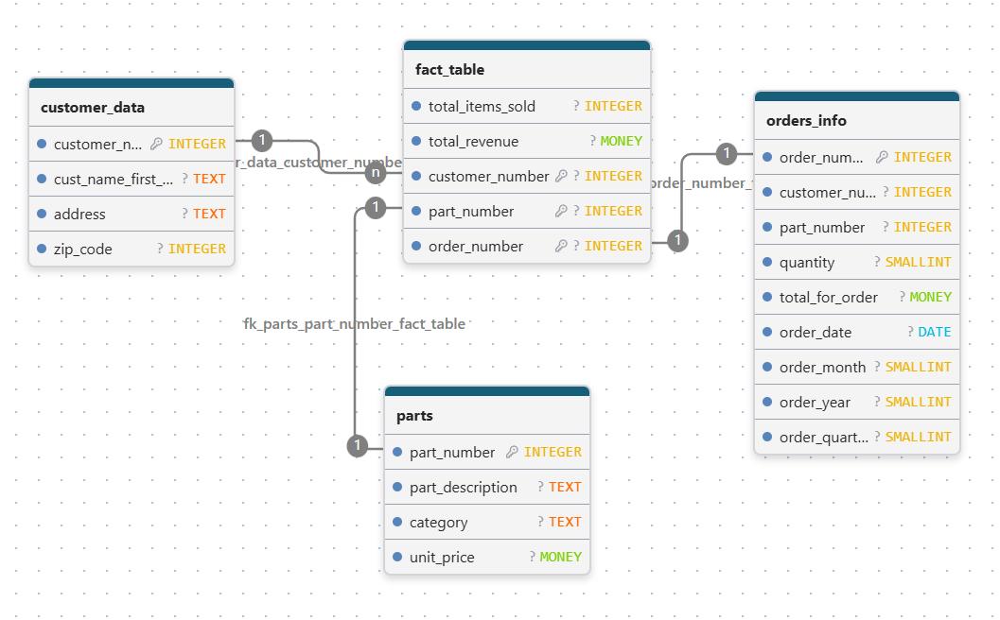

# Module 6 - Exercise 1: Creating a Data Warehouse

From the Operational Model to the Dimensional Model

- Name: Kim Hummel
- Course: Database for Analytics
- Module: 6

---

## Overview

In this exercise you will design a **dimensional (star schema) model**
for a data warehouse based on an **operational sales database**.

- **Business process:** Customer Sales
- **Grain:** Daily sales
- **Facts to store (only):**
  - **amount** = daily sales total amount (revenue)
  - **quantity** = daily sales total quantity (units sold)

You will determine the dimensions needed to support the required analytics.

---

## Operational Database Summary (Source System)

Tables in the operational model include:

- `customer` (custNumber, custName, address, currBal, credLimit, repNum)
- `parts` (partNum, partDesc, category, unitsOnHand, warehouseNum, unitPrice)
- `slsrep` (repNum, repName, repAddress, totComm, commRate)
- `orders` (orderNum, orderDate, custNum)
- `orderline` (orderNum, partNum, numOrdered)

---

## Analytics Requirements (What the Warehouse Must Support)

Your dimensional model must support questions such as:

- How many of part number **ax12** were sold on **September 2, 1994**?
- How many of part number **ax12** did customer **124** purchase last year?
- How much did customer **124** spend last year?
- What was the **average amount spent per customer per day** during September 1994?
- What was the **average quantity sold of part ax12 per day** during September 1994?
- What was the **average daily sales** during the third quarter of 1994?
- How many **appliance** items were sold during the third quarter of 1994?
- What was the amount of revenue generated by customers in
  **zip code 64468** during September 1994?

---

## Out of Scope

We do **not** care about:

- Questions about **specific orders** (order-level reporting)
- Questions about **sales reps**
- Questions about **credit limits, balances**, or other customer finance fields
- Inventory questions (warehouseNum, unitsOnHand, etc.)

---

## Key Design Constraints

- The warehouse must be a **star schema**.
- The fact table must store only:
  - `amount`
  - `quantity`
- Data must be **aggregated as necessary from the operational database before loading**.
- The grain is **daily sales** (not per order, not per orderline).

---

## Your Task

### Step 1: Design the Star Schema

Create a dimensional model that includes:

- One **fact table** (daily customer sales facts)
- Appropriate **dimension tables** (you decide which ones are necessary)

Your model must clearly show:

- Fact table name and fields
- Dimension table names and fields
- Primary keys and foreign keys
- Relationships (dimensions connect to the fact table)

---

## Deliverables

### 1) Star Schema Diagram (Required)

Create and submit a **diagram** of your star schema.

You may use any tool, such as:

- draw.io (diagrams.net)
- PowerPoint
- Google Drawings
- Lucidchart
- Hand-drawn on paper (then take a clear photo)

Save your diagram image in this repo and embed it below.

**File name suggestion:** `star-schema.png` or `star-schema.jpg`

#### Diagram

---

### 2) Design Notes (Required)

In 1-2 short paragraphs, explain:

- What dimensions you chose and why
- Why your fact table grain is daily sales
- How your design supports at least 3 of the required analytics questions

#### Design Notes

To start with, I immediately wanted to identify the grain, which we are told is daily sales. This way I would immediately how deep I needed to go. I confirmed this through the questions as they asked about days, not exact times or times of day. I then read through all of the questions we would need to be able to answer and that let me to decide which dimensions were needed. This was the background work I needed to do to understand what the task was asking and to decide how to organize all of the dimensions.

Then, I got started building the data warehouse schema. I started with the facts table, which I called "customer_sales" and put in total_revenue (amount) and total_items_sold (quantity) as those were the facts we were told to store in the facts table. I knew from the questions that we would need to be able to break orders down by year, day, month, and quarter, so I added those dimensions. One of the main facts is number of items sold so I knew I would need the quantity of each part sold as well. A question asked about appliance items, so I know I needed to keep the category dimension when I was collecting information about parts. I obviously needed the monetary value of the parts as I wanted to find the total revenue. The question about the zip code meant that I needed to pull the zipcode from the customer's address.

Once I created all of my dimensions and double checked that I could answer every question based on my dimensions, I connected them to my facts table by putting foreign keys into the facts table. I struggled with this because based on the directions I thought I could only have two things in my facts table, but AI told me otherwise. So I google for better sources just to double check and then added in my foreign keys. 
