# Final Project: Database Creation and Exploration

- Name: Kim Hummel
- Course: Database for Analytics
- Module: 7
- Database Used: US Department of Veterans Affairs Data Catalog
- Tools Used: PostgreSQL

## Original Data Source

I was searching for larger data sets and came upon the veterans database. I was originally looking at their suicide prevention data, but it was taking a long time to download so I started exploring their other data. As I was searching the database, there were multiple data sets labeled for the year 2023. As I looked at each data set, they were descriptors of veterans. I knew these could be joined together and analyzed.

https://www.data.va.gov/browse?sortBy=relevance&pageSize=20&limitTo=datasets&q=2023

[Link to Raw Data Files: project7_raw_data](../data/project7_raw_data/)

I originally pulled 5 spreadsheets to use as a database, but realized that one was redundant and that five was too many to work with for this project, so I narrowed it down to three. The three spreadsheets I used for this project are: county_data_2023, disability_by_county_2023, and poverty_disability_2023.

## Formatting Data

Before I uploaded the data I reformated the column names to align with standard practices and to lessen the chances of misspellings and typos on my part. I also made any missing values blank so it would bring up a "null" output instead of having to worry about which tables has dashes and which ones were blank.

When I tried to load the data from the csv files into PostgreSQL I kept getting error messages because the numerical values in the column had a comma in them, so it read it as two numbers in the same cell. In order to correct this I changed the data type from integer to text and was then able to upload the CSV. Then I used AI to help me remove the comma from the cells and then I changed the data type back into an integer.

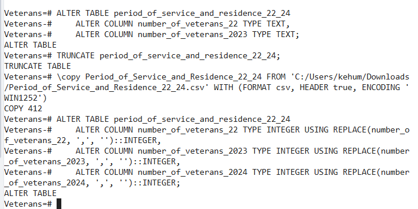

After the data was uploaded I then added some new columns to the data. For both the county_data_2023 table and the poverty_disability_2023 table I extracted the year from the timestamp column, called pull_date on both tables. This wasn't really necessary for the county_data_2023 table as the timestamp was the same for every row, but it was important for the poverty_disability_2023 table as it contained data for the years 2023, 2024, and 2025.

The poverty_disability_2023 age_group column only had two options; Less than 65 or 65 and older. The county_data_2023 had 4 categories in its age_group column. So I created a new column called bi_age_group that had the the same two options as the age_group column in poverty_disability_2023 so that they could be more easily compared.

## Clean Data

### county_data_2023

The county_data_2023 in the fact table. It is a CSV file that has 7 columns and 781,200 rows. It has one date column, two integer columns, and four text columns. The data is time stamped from the date the data was pulled. It then contains every county in every state, and breaks down the number of veterans there based on age group and gender.

|Column Name| Data Type| Description|
|:------------:|:------------:|:-------------------------|
|pull_date| date| It is time stamped without a timezone. It gives the time that the data was pulled, and therefore accurate for that moment in time. It is the same for every row.|
|fips| integer| An ID number for each county in each state. It is the foreign key for disability_by_county_2023 table.|
|county_state| text| Follows the County, State Abbreviation format.|
|just_state| text| Is just that, the state.|
|age_group| text| 4 options: 17 to 44, 45 to 64, 65 to 84, 85 and older.|
|sex| text| Either male or female.|
|veterans| integer| The number of veterans in that group: county, per age group per gender.|
|year_pull| integer| This column is the year this data is active as it was derived from the pull_date column.|
|bi_age_group| text| Groups ages as either less than 65 or 65 and greater.|

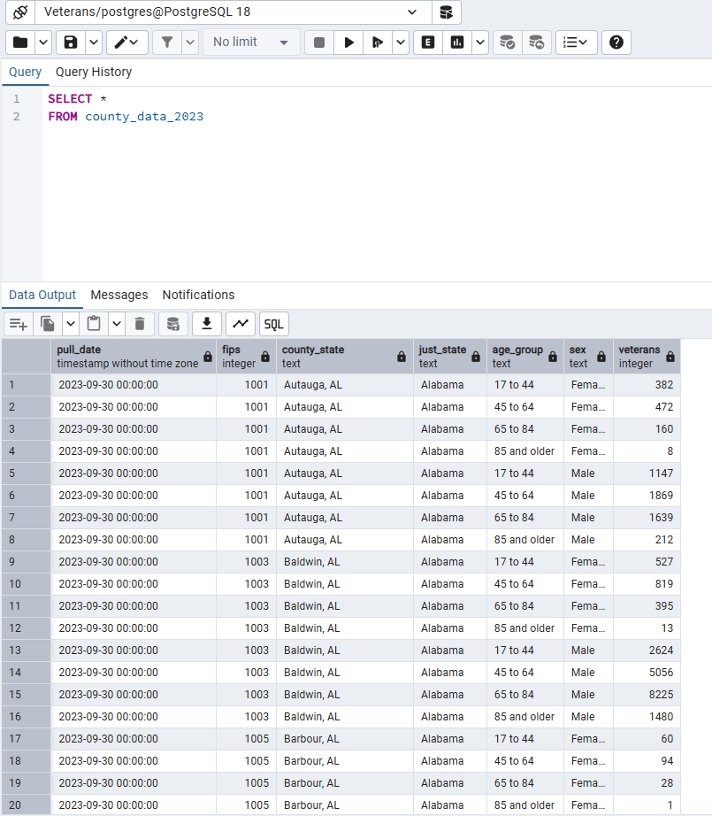

### disability_by_county_2023

The disability_by_country_2023 is a dimension table whose key to the fact table is its FIPS code. It has 14 columns and 3,147 rows. There are two text columns and 12 integer columns. The table shows each county in each state, and then breaks down the total recipients by age, gender, and the percent of their service connected disability.

|Column Name| Data Type| Description|
|:------------:|:------------:|:-------------------------|
|fips_code| integer| An ID number for each county in each state.|
|state| text| The name of the state the county resides in.|
|county_name| text| The name of the county.|
|total_recipients| Integer| The total number of veterans that receive VA disability compensation benefits.|
|scd_0_20_percent| Integer| The number of veterans with a service-connected disability rating between 0% and 20%.|
|scd_30_40_percent| Integer| The number of veterans with a service-connected disability rating between 30% and 40%.|
|scd_50_60_percent| Integer| The number of veterans with a service-connected disability rating between 50% and 60%.|
|scd_70_90_percent| Integer| The number of veterans with a service-connected disability rating between 70% and 90%.|
|scd_100_percent| Integer| The number of veterans with a service-connected disability rating of 100%.|
|age_17_44| Integer| The number of veterans in the county that are receiving VA disability compensation benefits and are between the ages of 17 and 44.|
|age_45_64| Integer| The number of veterans in the county that are receiving VA disability compensation benefits and are between the ages of 45 and 64.|
|age_65_older| Integer| The number of veterans in the county that are receiving VA disability compensation benefits that are 65 and older.|
|male| Integer| The number of veterans in the county that are receiving VA disability compensation benefits that are male.
|female| Integer| The number of veterans in the county that are receiving VA disability compensation benefits that are female.

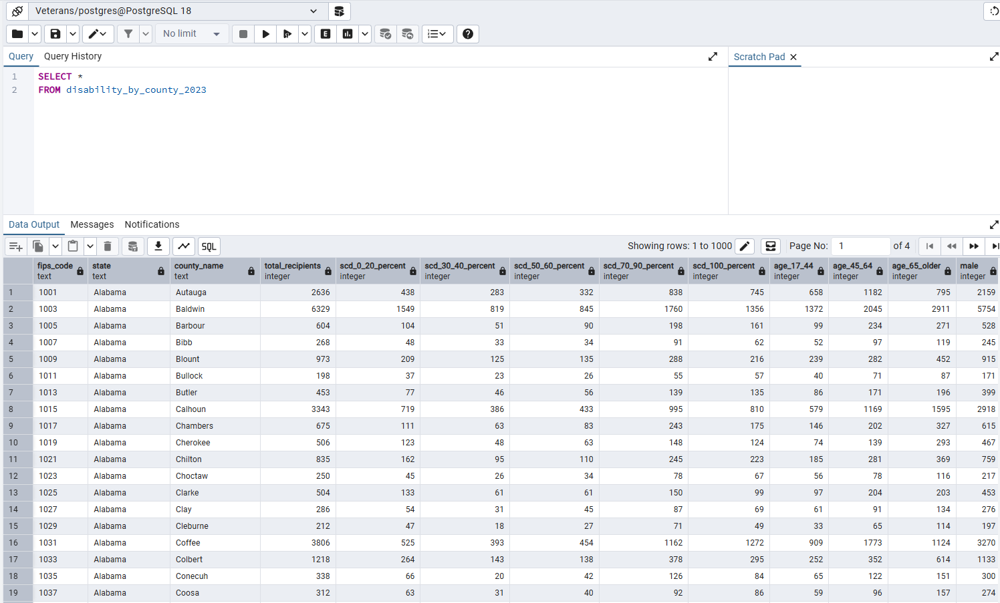

### poverty_disability_2023

The poverty_disability_2023 table is a dimension table. The key that connects it to the fact table will be age_group. It has 6 columns and 48 rows. One of the columns is a time stamp, four are text, and one is an integer. It tells the number of veterans that, time stamped per year, then broken down by rural or urban, the age group (under 65 or 65 and older), below or above poverty level, and then has a disability or not.

|Column Name| Data Type| Description|
|:------------:|:------------:|:-------------------------|
|pull_date| date| It is time stamped without a timezone. It gives the time that the data was pulled, and therefore accurate for that moment in time. It is the same for every row.|
|urban_rural| text| Whether or not the veteran lives in an urban or rural area.|
|age_group| text| Whether or not they are less than 65 years old, or if they are 65 years or older.|
|poverty| text| Whether or not the veteran lives below the poverty line, or at or above the poverty line.|
|disability| text| Either the veteran has a disability or does not have a disability.|
|veterans| integer| The number of veterans that fit into the category.|
| year_pull| integer| This is the year pulled from the timestamp that exists in the pull_date column.

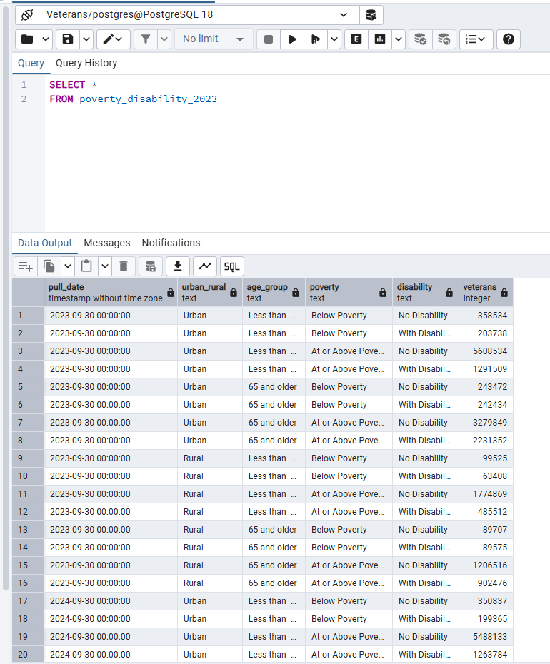

## Structure

I created a star warehouse that had the county_data_2023 as the fact table, and the two other tables as the dimension tables.

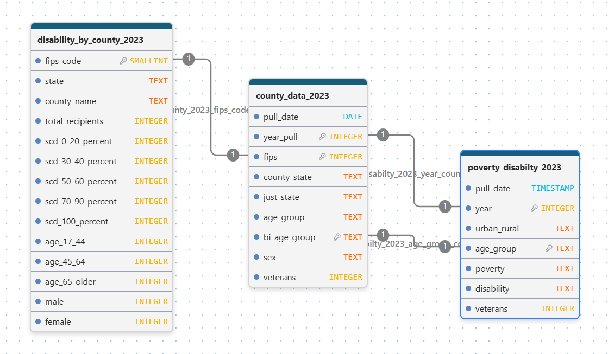

## Basic Analysis

To start understanding the data better I just did some basic analysis based on what I was seeing in the first few rows of the data.

### disability_by_county_2023 Analysis

I started with the disability_by_county_2023 and found the states with the highest number of disability recipients.

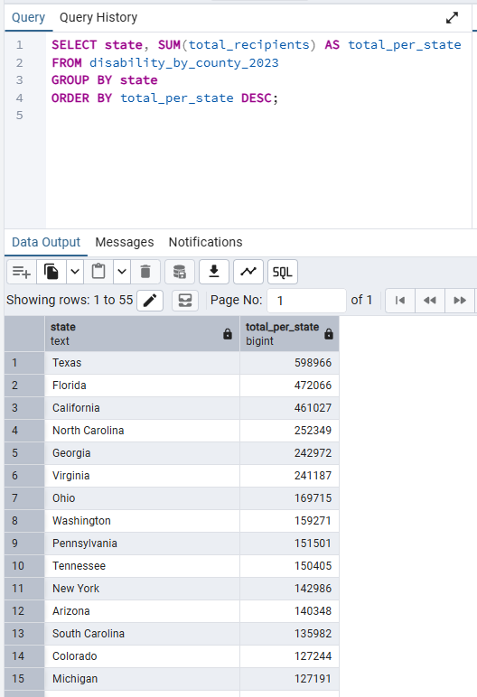

Then I found the top 5 states that had the most veterans with 100% service connected disability. The states were also the top 5 for total number of veterans receiving disability but in a slightly different order.

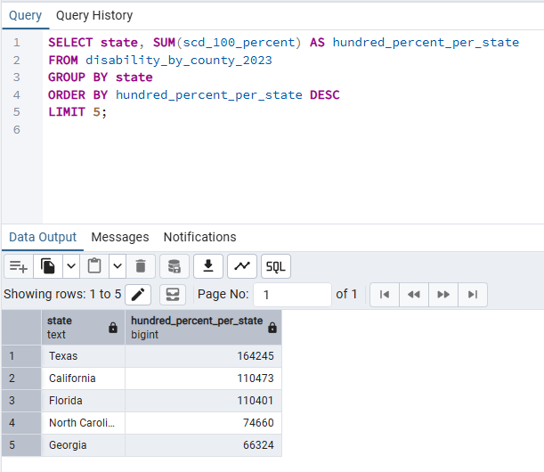

I wanted to go deeper with this data and find which counties had the highest number of veterans that are disability recipients. It is not surprising that 10 out of the top 15 counties came from the top 5 states with the highest number of veterans that are disability recipients.

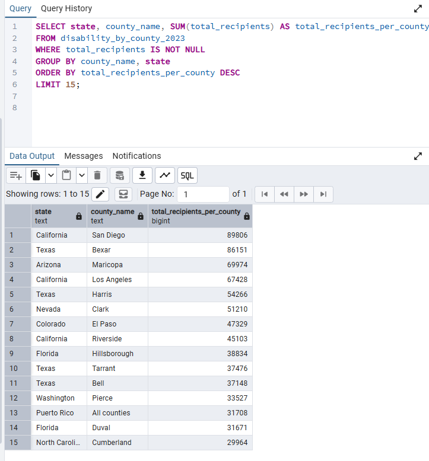

### county_data_2023 Analysis

I started by finding the number of veterans per county, separated by age group.

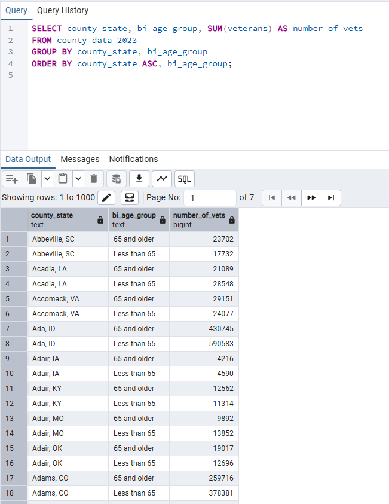

This was too broad of data, so I decided to find the percentage of veterans that were 65 and older, and the percentage of veterans that were less than 65. I started by figuring out the count of the number of veterans in each age category, and then use AI to help me turn it into percents.

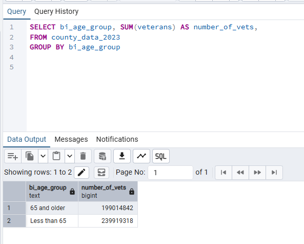

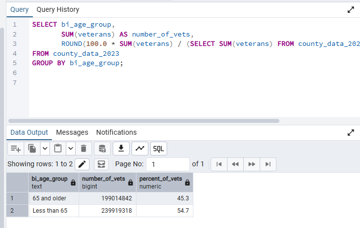

This shows that there are more veterans aged 65 and older, than there are veterans under the age of 65. This hints that less people are joining the armed services that in previous generations. One area of possible future research is to see why this is the case. Why are less people joining the armed services?

### poverty_disability_2023

This table focused on whether veterans lived in urban versus rural areas, below poverty or at or above poverty, with disability or no disability. With this table I only used the data from 2023.

I started by finding the number of veterans living in rural areas versus urban areas and found that almost three times as many veterans live in city (urban) areas as opposed to rural areas.

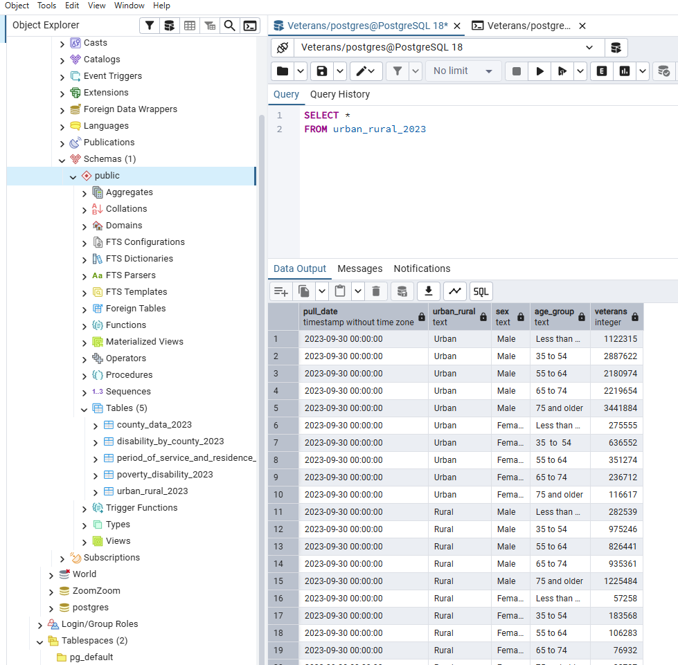

Then I looked at the number of veterans based on their age, and then whether or not they had a disability. I originally just found the number values, but decided to calculate the percents again as I felt that made it easier to compare the amounts. From the percents, you can see that there are more veterans without a disability than there are veterans with a disability in both age groups. However, in the 65 and older group, it is closer to a 60-40 split whereas the less than 65 group is closer to an 80-20 split. This means that the percentage of veterans above 65 that have a disability is higher than that of veterans under the age of 65.

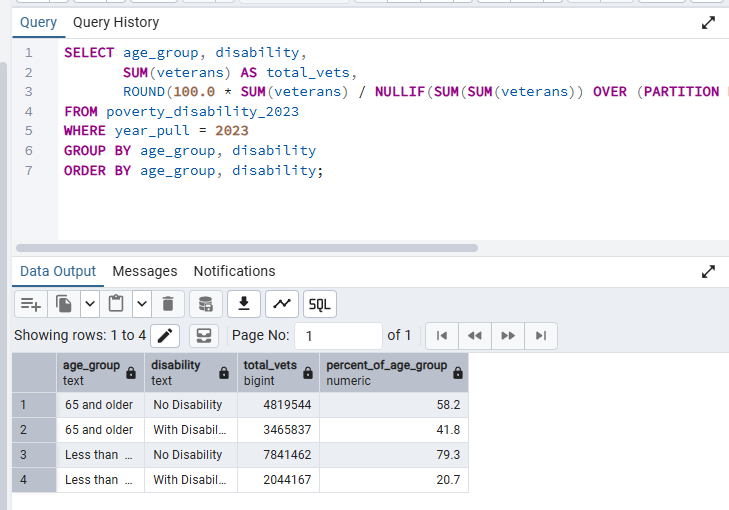

## Joining Tables

I had to work a long time on and get some help from AI on joining the disability_by_county_2023 table with the county_data_2023 table. The problem was that the tables had a lot of similar information, but they were just set up differently. In the disability_by_county_2023 table, each county only had one row, and then the columns were the other categories broken down. Whereas in the county_data_2023 table each county had multiple rows with the category breakdown in single columns. So the age range was broken down in one column where in the other table the age range was split between columns.

I knew my key was the fips number, but when I tried to join the tables to see which county had the highest percent of veterans on disability, it was giving me incorrect ratios, or percents as I had them in my table. It was telling me that the number of veterans with disabilities was over 100%, and that is not possible.

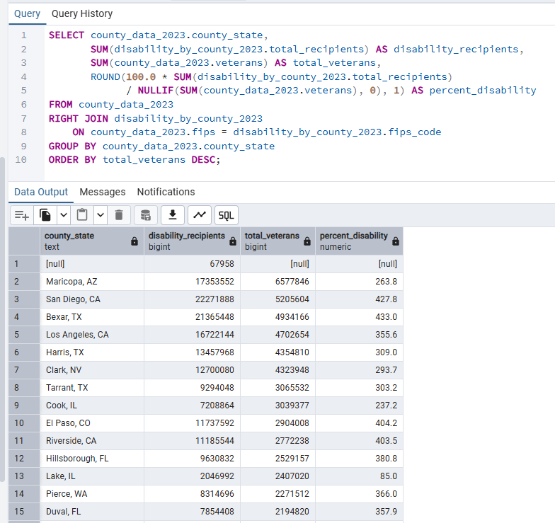

When I had used AI to correct my errors when I was trying to write the code for the percentage column, it had warned me that because I was joining and then adding values, values would be added multiple times and make the true values incorrect. AI said that I needed to find the sums first before joining the tables so that is what I did. I did use AI to help me with the notation and correct my errors. That gave me a much more reasonable result.

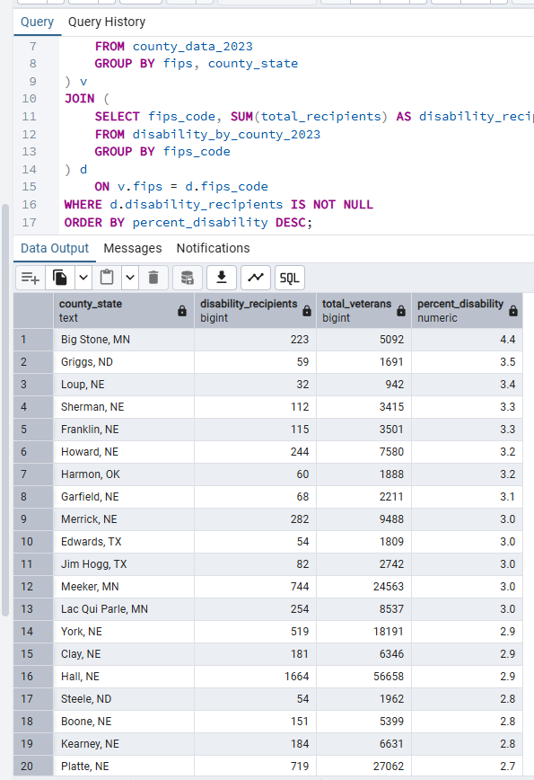

This shows that a count and a percentage of a population tell two different stories. The majority of the counties with the highest percentage of veterans with disabilities were not even in the states that had the highest number of veterans with disabilities. An area of research could be as to whether or not small or large communities were better equipped to handle veterans with disabilities.

## Insights

The work that I did barely scratched the surface of what this data could be used for.

When looking at urban versus rural veterans, we could analyze where they lived while they were in active service and before they were in the service to help determine the choice of location after service. In my analysis, I had age broken down into two main categories, but there was plenty of data with smaller age categories. It would be worth looking into the specificity of those age groups. Looked at the degree/percentage of service connected disability would have been interesting as well. There were also tables that broke down the number of veterans that served in each conflict/period of war. If this could be connected to the number of veterans by age group it would help us know how old soldiers were when they fought in combat.

## Shortcomings

While this project had some interesting data points, there were some shortcomings. This was mainly due to the data choice. I had originally picked a different set of data, but it had a lot of missing value, non standardized values, and did not have ways to be joined without doing research outside of the data given. Because of this, I changed the dataset I was using and picked something that I felt was good enough because I was behind. Two of the tables did have time stamps, so they meat the "date" requirement. However, in one table the time stamp was exactly the same in every row so it didn't mean much. In the second table with a time stamp it did have a different year, but everything else in the time stamp was the same. Two of the tables were very easy to join because they had a specific fips code for the county. However, the third table, poverty_disability_2023 didn't really link to the star table, or the other dimension table for that matter. When I picked this data set I thought they would but when I started working with the data I found that there was no straight forward key between them. It would have been much more interesting to have tables that I could have joined together in a more comprehensive way. Even though the join between the two tables was easy, it didn't provide much in terms of unique analysis because most of the data was in both tables, just in a separate format.

If I could do this project again I would take more time to find a data set that allowed me to do a more thorough analysis, where I could focus on the data, and then connections between it, and what it meant. Instead I spent a lot of time trying to figure out how I needed to manipulate the data to make sure I was hitting all of the requirements for the project. 
